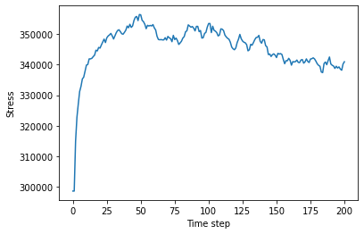

- objective:visualizing the dem data and extracting any information we can get from dem data
- Exporting the directory
- importing the files directory into phython
- importing mathplotlib
- printing macrostress.shape
- setting first index as timestep
- setting second index as stress
- printing the data into plot
- recommendation: missing units for time step and stress

